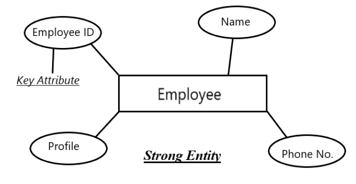
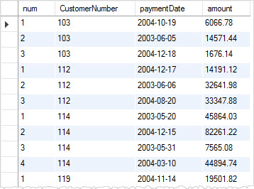

# Almacenamiento de datos

Las bases de datos almacenan la información de una manera estructurada, lo cual permite que el acceso, modificación y consulta sea más eficiente y sencillo.&#x20;

Para crear una base de datos es necesario definir la forma en la que la información se va a estructurar. Para ello debemos crear los siguientes elementos:

* **Entidades o tablas:** son colecciones de datos complejos que representan objetos del mismo tipo. Por ejemplo, en la base de datos de una tienda las entidades podrían ser: Producto, Cliente, Pedido...
* **Atributos:** Cada entidad, definirá un conjunto de atributos asociadas a la misma. Esto permitirá que asociemos varios datos a una misma entidad. Por ejemplo, la entidad Producto podría tener como atributos: el nombre del producto, el precio, una etiqueta que lo clasifique...

<figure><figcaption>
Entidad Employee con cuatro atributos 
</figcaption></figure>

Una vez definida la estructura, ya podemos introducir datos en la misma. Los datos se van a definir de la siguiente manera:

* **Registro:** Un registro lo conforman un conjunto de datos que representan una entidad. Por ejemplo, en la entidad Producto podríamos tener estos registros:
  * Registro 1: Nombre-> Tornillo, Precio -> 0.30€, Etiqueta -> Ferretería
  * Registro 2: Nombre-> Televisor, Precio -> 300€, Etiqueta -> Electrónica
* **Campos:** Cada uno de los valores que conforman un registro es un campo. Por ejemplo el registro 1 tiene los siguientes campos:
  * Nombre-> Tornillo
  * Precio -> 0.30€
  * Etiqueta -> Ferretería

<figure><figcaption>
Registros de pedidos, cada registro define 4 campos
</figcaption></figure>
