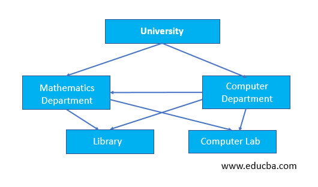

# Modelo en red

El modelo de datos en red aparece a mediados de los sesenta como respuesta a limitaciones del modelo jerárquico en cuanto a representación de relaciones más complejas.

El modelo en red organiza la información en **registros** (también llamados **nodos**) y enlaces. En los registros se almacenan los datos, mientras que los enlaces permiten relacionar estos datos. Las bases de datos en red son parecidas a las jerárquicas sólo que en ellas **puede haber más de un padre** (grafo en lugar de árbol).

En este modelo se pueden representar perfectamente cualquier tipo de relación entre los datos, pero hace muy complicado su manejo. Al no tener que duplicar la información se ahorra espacio de almacenamiento.

<figure><figcaption>
Base datos de universidad
</figcaption></figure>

 

<figure><figcaption>
Base de datos de proyectos
</figcaption></figure>

\
