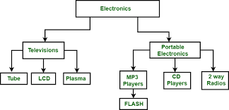

# Modelo jerárquico

También recibe el nombre de **modelo en árbol**, ya que utiliza una estructura en árbol invertido para la organización de los datos.

La información se organiza con un jerarquía en la que la **relación** entre las entidades de este modelo siempre es del tipo **padre/hijo**. De tal manera que existen nodos que contienen atributos o campos y que se relacionarán con sus nodos hijos, pudiendo tener cada nodo más de un hijo, pero un nodo siempre tendrá un sólo padre.

Los datos de este modelo se almacenan en estructuras lógicas llamadas **segmentos**. Los segmentos se relacionan entre sí utilizando **arcos**. La forma visual de este modelo es de árbol invertido, en la parte superior están los padres y en la inferior los hijos.

Hoy en día, debido a sus limitaciones, el modelo jerárquico está **en desuso**. En el siguiente gráfico puedes observar la estructura de almacenamiento del modelo jerárquico.

<figure><figcaption>
Base de datos de productos electrónicos
</figcaption></figure>
