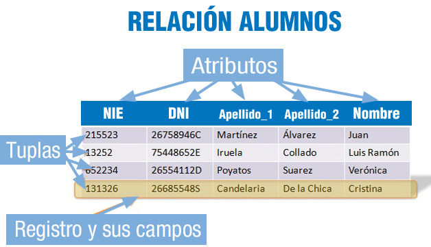

# Modelo relacional

Hoy en día las bases de datos relacionales son las más utilizadas.

En el modelo relacional la base de datos está compuesta por un **conjunto de tablas**.&#x20;

El modelo relacional utiliza **tablas bidimensionales** (relaciones) para la representación lógica de los datos y las relaciones entre ellos. Cada relación (tabla) posee un nombre que es único y contiene un conjunto de columnas.

Se llamará **registro, entidad o tupla** a cada fila de la tabla y **campo o atributo** a cada columna de la tabla.

A los conjuntos de valores que puede tomar un determinado atributo, se le denomina **dominio**.

Una **clave** será un atributo o conjunto de atributos que identifique de forma única a una tupla.

Las tablas deben cumplir lo siguiente:

* Todos sus registros son del mismo tipo.
* La tabla sólo puede tener un tipo de registro.
* No existen campos repetidos (dentro de una misma tupla).
* No existen tuplas duplicadas.
* No existe orden en el almacenamiento de las tuplas.
* Cada registro o tupla es identificada por una clave que puede estar formada por uno o varios campos.

<figure><figcaption>
Relación (tabla) Alumnos
</figcaption></figure>

El lenguaje habitual para construir las consultas a bases de datos relacionales es **SQL** (Structured Query Language), un estándar implementado por los principales motores o sistemas de gestión de bases de datos relacionales.

Durante su diseño, una base de datos relacional pasa por un proceso al que se conoce como **normalización** de una base de datos.
