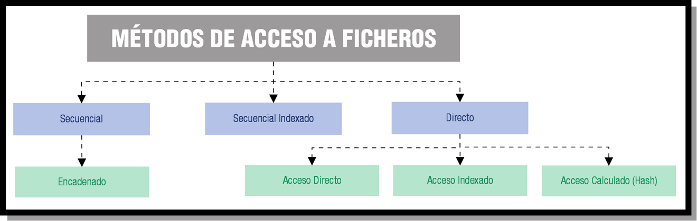

# Organización interna y tipos de acceso

A medida que la tecnología ha ido evolucionando, atendiendo principalmente a los avances hardware, el acceso a la información contenida en los diferentes tipos de ficheros ha variado mucho.

Los objetivos fundamentales de estas modificaciones pueden resumirse en los siguientes puntos:

* Proporcionar un **acceso rápido** a los registros.
* Conseguir **economizar el almacenamiento**.
* Facilitar la **actualización** de los registros.
* Permitir que la **estructura** refleje la organización real de la información.

Las distintas formas de organizar un fichero en un soporte de memoria o, lo que se conoce también por métodos de acceso a los ficheros se detallan en el siguiente gráfico.

<figure><figcaption>
Clasificación de ficheros por su organización interna y acceso
</figcaption></figure>

Las organizaciones **secuencial**, de **acceso aleatorio o directo** y de acceso **indexado** son las más comunes.
