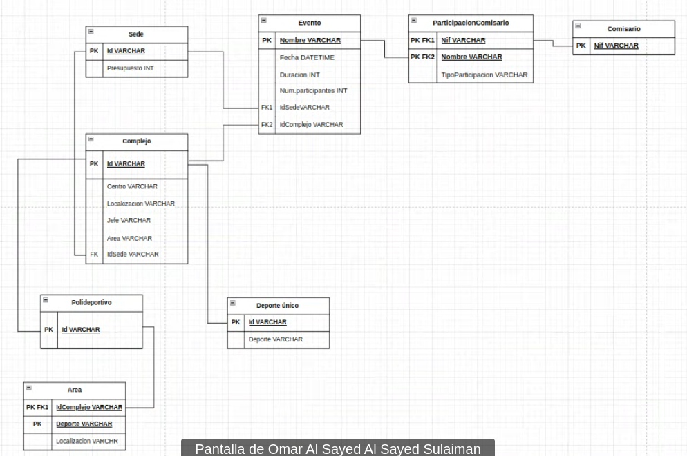

# Soluciones de diagramas ER

1.  Diseña el diagrama de entidad-relación de una base de datos de los alumnos un instituto:

    <figure><figcaption></figcaption></figure>
2.  Diseña el diagrama de entidad-relación de una base de datos de los departamentos de un instituto:

    <figure><figcaption></figcaption></figure>
3.  Diseña el diagrama de entidad-relación de una base de datos de una empresa:

    <figure><figcaption></figcaption></figure>
