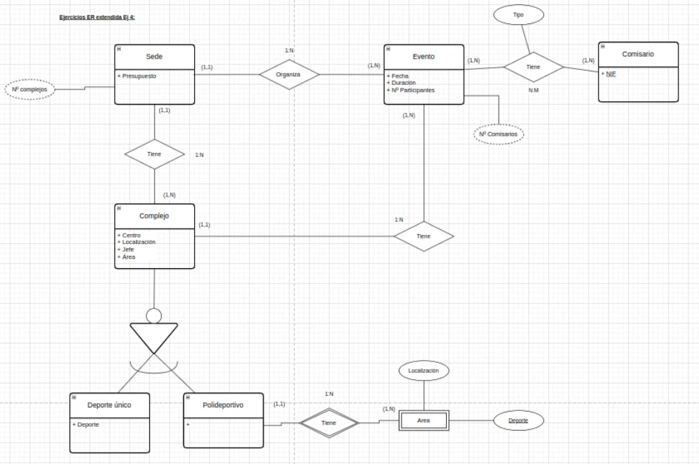

# Soluciones ER ternarias y reflexivas

1.  En una universidad, para facilitar la gestión de las enseñanzas, se quiere almacenar información relativa a los alumnos, como por ejemplo el número de la matrícula, el nombre, la fecha de nacimiento y su teléfono. Se quiere saber también si el alumno está matriculado de una o de varias asignaturas, teniendo en cuenta que el alumno puede llegar a matricularse en la misma asignatura en más de un curso (en los casos en los que repite), por tanto, hay que registrar el curso escolar en el que cada alumno está matriculado de cada asignatura. (atributo en la relación) En una asignatura (de la cual se guardará su código y su nombre) habrá entre 10 y 25 alumnos matriculados. Una asignatura será impartida por un único profesor, mientras que un profesor impartirá varias asignaturas. Además, de los profesores es conveniente saber su identificador, su nombre, su especialidad y su número de teléfono.\
    \

    <figure><figcaption></figcaption></figure>
2. Se desea almacenar información de recetas de cocina:
   1. Cada receta tiene un nombre y una duración
   2. Las recetas usan ingredientes. De cada ingrediente guardamos el nombre, y el tipo.
   3. Cada receta usa una cantidad distinta de cada ingrediente
   4. Cada recete es obra de un chef.&#x20;
   5. De cada chef deseamos saber el NIF, nombre y apellidos
   6.  Algunas recetas están basadas en otra receta, se desea almacenar esta relación.\

       <figure><figcaption></figcaption></figure>
3. Se desean guardar los datos del trabajo en un hospital:
   1. De cada médico almacenaremos su NIF, nombre, apellidos.
   2. Cada médico puede tener varias especialidades, de cada especialidad guardaremos el nombre y el campo.
   3. De cada enfermero almacenaremos su NIF, nombre y apellidos
   4. De cada paciente almacenaremos su Id de paciente, nombre y apellidos
   5.  Cada paciente será atendido por un médico y una enfermera simultaneamente. Cada vez que sea atendido se debe almacenar la fecha y hora.\

       <figure><figcaption></figcaption></figure>
4.  Se desean guardar los datos de un banco:

    1. De cada sucursal: un identificador, una provincia y una dirección
    2. De cada cliente: su NIF, nombre y apellidos
    3. De cada Cuenta: IBAN, saldo, tipo
    4. De cada Hipoteca: Nº de póliza, meses restantes, interés, tipo, saldo
    5. Los clientes han abierto sus cuentas en una sucursal y esta información debe quedar así almacenada.
    6. Los clientes han contratoda sus hipotecas en una sucursal, también se debe almacenar esto.
    7.  Hay clientes que han referenciado a amigos y se han hecho clientes. Queremos guardar esta información. Además se desea almacenar la fecha en la que referención al otro cliente.\
        \

        <figure><figcaption></figcaption></figure>

