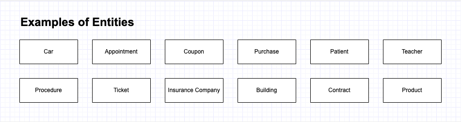

# Entidades

Una entidad es cualquier objeto o elemento acerca del cual se desea almacenar información en la base de datos. Algunas de sus características fundamentales son:

* Las entidades pueden ser **concretas** (como un libro, alumno, aula...) **o abstractas** (como una asignatura, departamento, profesión...).&#x20;
* Todas las entidades que representan objetos o elemento del mismo tipo se almacenan en el mismo **tipo de entidad**. Por ejemplo, podemos tener el tipo de entidad Persona y almacenar en la misma los datos de varias personas (cada una de esas personas será una entidad)
* Los tipos de entidades **se representan gráficamente mediante** **rectángulos** y su nombre aparece en el interior.&#x20;
* **No pueden existir dos tipos entidad con el mismo nombre** en el mismo esquema conceptual.

En el diagrama de entidad-relación se representa la colección de tipos de entidad que comparten los mismos atributos y propiedades. Habitualmente, se sintetiza esta dualidad (entre entidades y tipos de entidad) reduciendo a entidad el tipo de entidad.

Para determinar si una determinada familia de objetos conforman una entidad (o más bien tipo de entidad) se deben cumplir las siguientes reglas:

* Una entidad debe tener **existencia propia**
* Cada ejemplar de la entidad debe poder **distinguirse de las demás**.
* Todos los ejemplares de una entidad deben tener las **mismas propiedades**.

<figure><figcaption></figcaption></figure>

### Clasificación de entidades

Hay dos tipos de entidades:&#x20;

* **Fuerte**: Los ejemplares de estas entidades no dependen de la existencia de datos relacionados en otras entidades
* **Débil**. La existencia de lo ejemplares depende de la existencia de otra entidad.

<figure><figcaption>
Base de datos de seguro de coche
</figcaption></figure>

\
