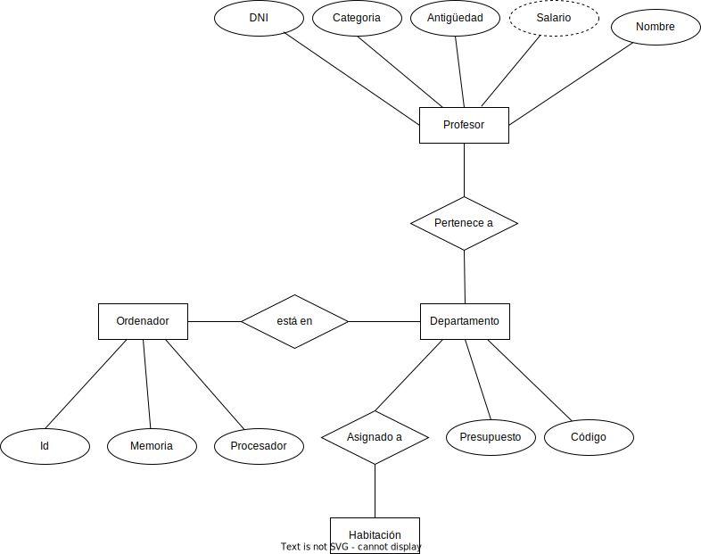

# Ejercicios transformaciones

1\.

<figure><figcaption></figcaption></figure>

2\.

<figure><figcaption></figcaption></figure>

3\.

<figure><figcaption></figcaption></figure>

4.\

<figure><figcaption></figcaption></figure>

5\.

<figure><figcaption></figcaption></figure>

6\.

<figure><figcaption></figcaption></figure>
